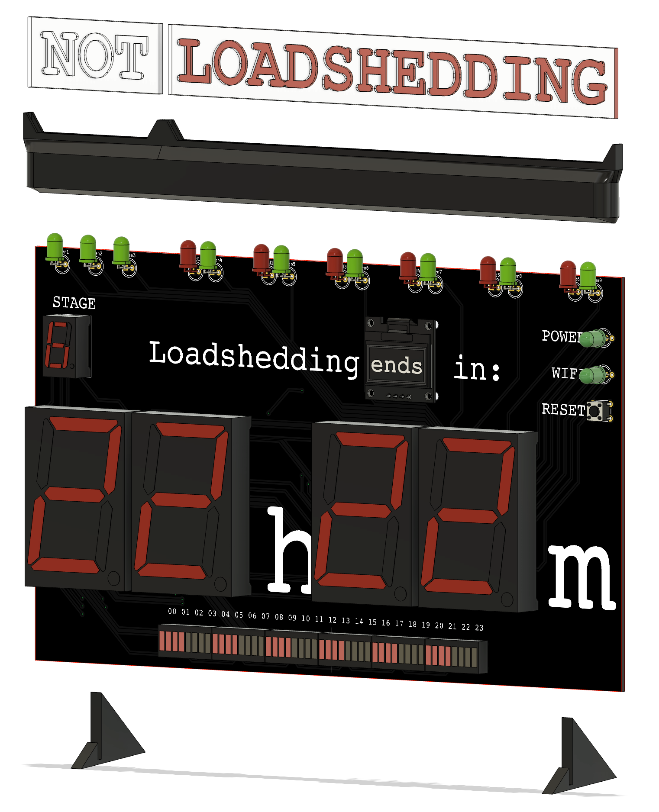

## 3D CAD files

This directory contains the 3D CAD files for the supporting parts of the loadshedding clock.

The files were designed in [Fusion 360](https://www.autodesk.com/products/fusion-360/overview).

## Loadshedding indicator adapter and Feet

The loadshedding indicator adapter is a 3D-printed part that allows the loadshedding indicator (acrylic panels) to be mounted on the clock.

The feet are 3D-printed parts that allow the clock to stand upright.

