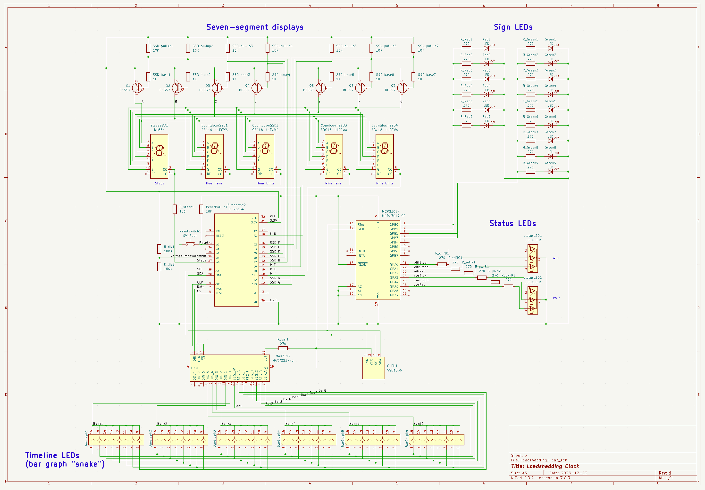
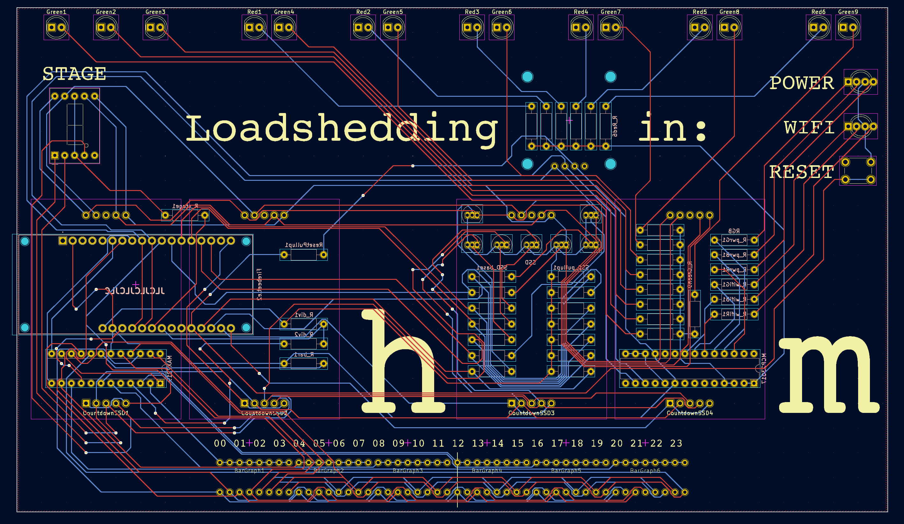
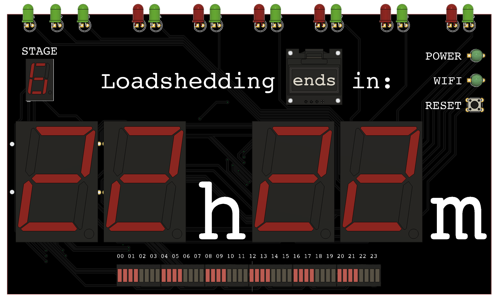
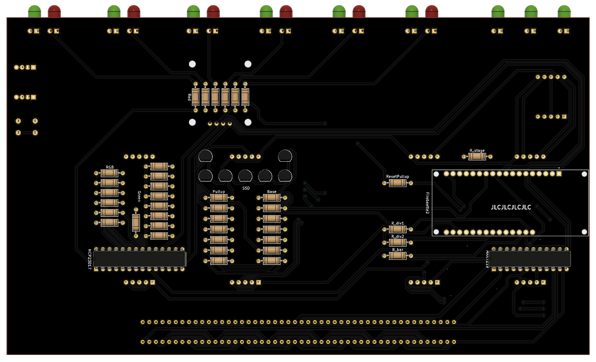

# PCB files

This directory contains the KiCad project files for the PCB.

Gerber files are available in [outputs](./outputs).

I used [JLCPCB](https://jlcpcb.com/) to manufacture the PCB.

## Schematic

## Board

## 3D renders

