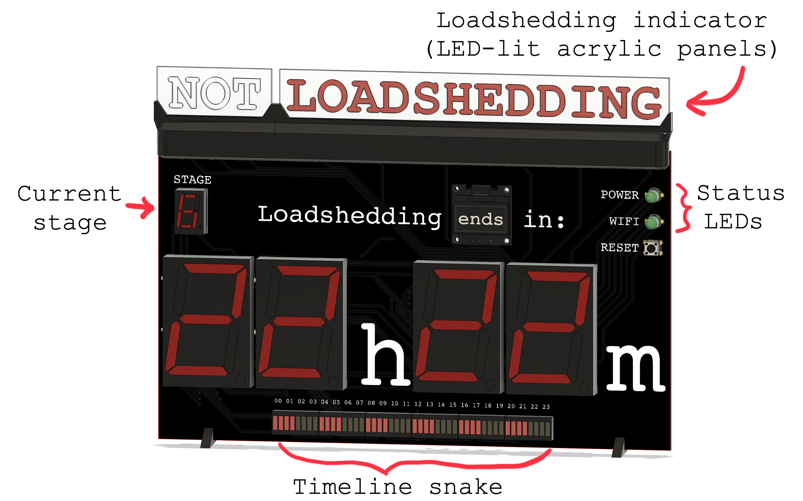
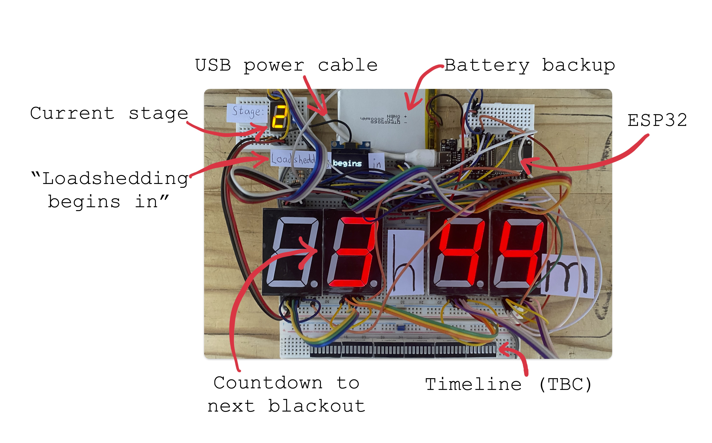

# Loadshedding Clock

A timer that counts down to the next scheduled blackout.

The clock is based on an ESP32, and it obtains loadshedding information from the [EskomSePush API](https://eskomsepush.gumroad.com/l/api).

All code is written in C++ using the [Arduino framework](https://www.arduino.cc/reference/en/) and [PlatformIO](https://platformio.org/). The code is available in [/loadshedding-clock-code/src](./loadshedding-clock-code/src).

The PCB schematics and board layouts can be found in [/PCB](./PCB).

CAD files for the 3D-printable parts can be found in [/3D](./3D).

## Why did I make this?

In South Africa, our national power utility (Eskom) [fails to generate](https://en.wikipedia.org/wiki/South_African_energy_crisis) sufficient electricity to supply the entire country with power. As a result, rolling blackouts have been implemented to ration electricity. Each day, regions of the country are disconnected from the power grid for hours at a time. Any given area typically experiences blackouts lasting 2 to 4 hours, multiple times each day. 

Fortunately, these blackout events are scheduled in advance. The timings of the blackouts change daily, and it can be challenging to keep track of when loadshedding will occur. Many South Africans rely on the [EskomSePush](https://esp.info/) app to stay informed about the loadshedding in their area. I wanted to take this one step further and make it even easier to stay informed. By simply glancing at the loadshedding clock, one can immediately see when the next blackout will occur.

## How does it work?

The clock is based on an ESP32 microcontroller. It connects to the internet via WiFi, and it obtains loadshedding information from the [EskomSePush API](https://eskomsepush.gumroad.com/l/api). The clock is powered by a 5V USB power supply, and it is equipped with a battery backup. 

When the clock is powered on for the first time, it broadcasts its own WiFi network. When the user connects to this network and visits a site hosted by the clock, they can input their WiFi credentials, suburb, and EskomSePush API key.

The clock then displays the loadshedding information for the given suburb, automatically updating its schedule every 30 minutes. If the internet connection is lost, it will continue to display the last schedule that it received from the API.

## What's next?

A PCB has been designed and ordered. Once it arrives, the clock will be assembled and tested.
Future versions may include the following:

- [x] ~~Get the clock working~~
- [x] ~~LED timeline~~
- [x] ~~LED-lit acrylic panel~~
- [x] ~~Design PCB~~
- [ ] Simplified 7-segment display circuitry
- [ ] Notification buzzer
- [ ] Capacitive touch input

## Bill of Materials
Work in progress.

| Part                                                                      | Quantity |
|---------------------------------------------------------------------------| -- |
| [FireBeetle 2 ESP32 Microcontroller](https://www.robotics.org.za/DFR0654) | 1 |
| [3.7V LiPo Battery](https://www.robotics.org.za/DTP605068)                | 1 |
| [I2C OLED Display](https://www.robotics.org.za/OLED096W)                  | 1 |
| [7 Segment Display 1.8" Common Cathode](https://www.robotics.org.za/7SEG-018-GRE) | 4 |
| [7 Segment Display 0.56" Common Cathode](https://www.robotics.org.za/7SEG-056-RED) | 1 |
| [BC557 PNP Transistor](https://www.robotics.org.za/BC557)                | 7 |
| [Green 5mm LED](https://www.robotics.org.za/LED-05-GRN-17)                | 9 |
| [Red 5mm LED](https://www.robotics.org.za/LED-RED-5MM)                | 6 |
| [Push button](https://www.robotics.org.za/TAC-66-H)                | 1 |
| [RGB LED](https://www.robotics.org.za/RGB-8MM-CC)                | 2 |

## Breadboard Prototype

